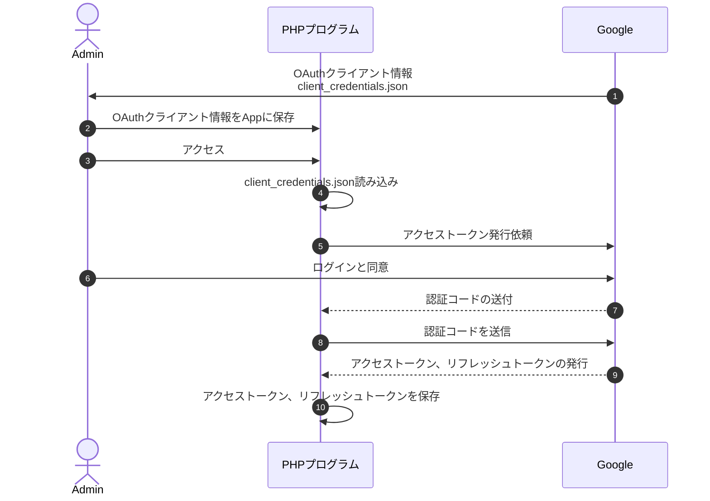
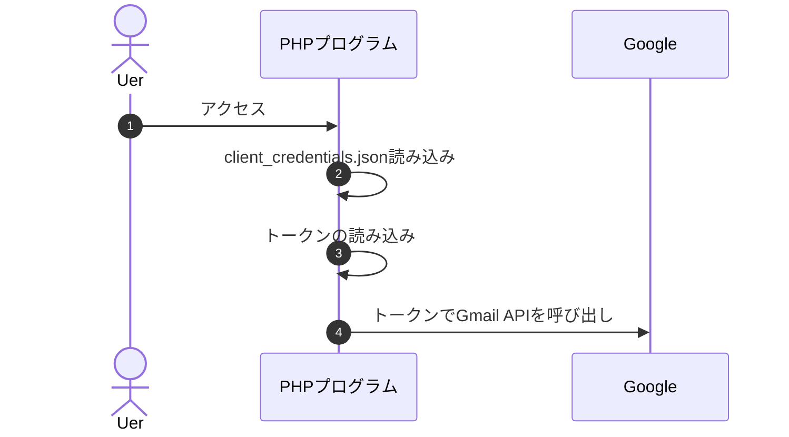

# Google APIのOAuth2.0を使ってPHPからGmailの送信サービスを利用する


## ディレクトリ構成
   
```
.
├── composer.json
├── composer.lock
├── README.md
└── src
    ├── config        client_credentials.jsonや、アクセストークンを設置するフォルダ
    ├── composer.json
    ├── composer.lock
    ├── oauth2callback.php    :アクセストークンの取得
    ├── send_mail.php         :メール送信プログラム
    └── index.php           　 :トップページ   
    
```


## 準備するもの
 * client_credentials.json
   * OAuth 2.0 クライアント IDを作成
   * OAuthクライアント情報を出力
   * client_credentials.jsonとしてconfigフォルダに保存

 

## シーケンス図 (アクセストークンの発行まで)




## シーケンス図  (メール送信等)



